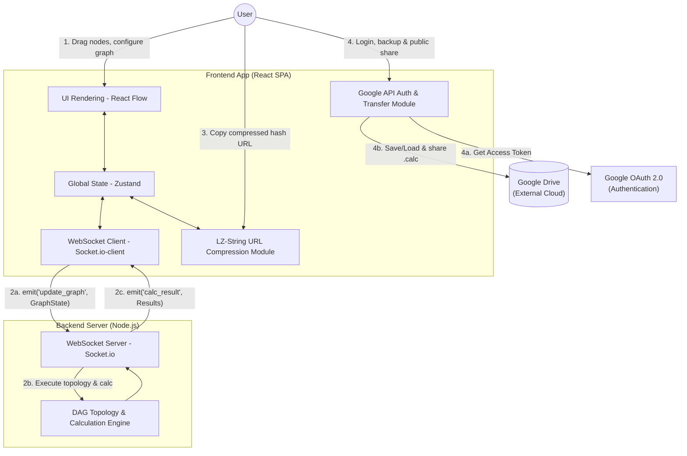
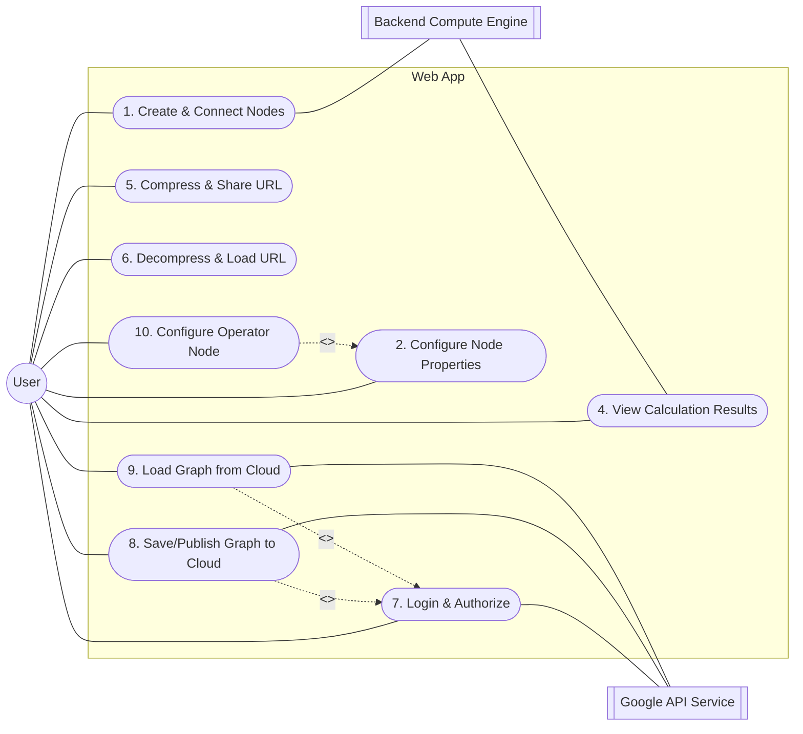

# Software Requirement Specification (SRS)

## 1. Introduction

### 1.1 Purpose

This document defines the architecture, functional/non-functional requirements, and system interfaces for the "Stateless & Decentralized Status Node Calculator". It serves as the core instruction manual for the development team and acts as the primary system context for AI agents during full-stack code generation.

### 1.2 System Scope

The system is a Web-based thin-client application providing gamers and theorycrafters with a visual, drag-and-drop node interface. It is used to construct complex RPG numerical formulas (e.g., damage/stat calculation) and simulate direct node additions and arithmetic operators in a visual flow.

The system supports **fully decentralized sharing mechanisms**: anonymous users can share templates instantly via LZ-compressed URL hashes, while authenticated users can utilize Google Drive API permission sharing for public persistent templates. There is no backend database, resulting in zero server storage costs and eternal link validity.

### 1.3 Glossary

- **DAG (Directed Acyclic Graph):** The core data structure for all numerical nodes and edges. Circular dependencies are strictly prohibited.
- **Operator Node:** A special node type that accepts two ordered inputs (A and B) and applies a user-selected arithmetic operation (+, −, ×, ÷) to produce a single output.
- **LZ-String Compression:** A high-speed compression utility used to compress JSON states into compact, URL-safe Base64 hashes.

---

## 2. System Architecture

### 2.1 System Architecture Diagram

> This diagram illustrates the decentralized data flow and protocols between the frontend, the stateless backend compute server, and external cloud services (Google Drive & OAuth).



### 2.2 Tech Stack Constraints

- **Frontend Framework:** React, TypeScript.
- **Backend Framework:** Node.js, Express, Socket.io (Stateless Microservice).
- **Database:** Fully Database-less (UGC Sharing is decentralized via LZ-String URL hash compression and Google Drive Sharing API).

### 2.3 Local & Collaborative Development Environment Specifications

The project utilizes Docker and Docker Compose for local backend microservice development.

#### 2.3.1 Containerization Configuration (Docker Compose)

A shared `docker-compose.yml` is maintained at the project root.

1. **Backend Layer (Node.js API & WebSocket):**
   - **Stateless Operation:** No database volumes are mounted. It is completely stateless.
   - **Hot-Reloading:** The backend container maps the local source code directory via Volumes and launches via `nodemon` or `tsx watch` for instant server reloads.
   - **Port Mapping:** Map host port `5000` to container port `5000`.

#### 2.3.2 Frontend Development Strategy

- The frontend application is run natively via `npm run dev` and communicates with the Dockerized backend (`localhost:5000`).

#### 2.3.3 Standard Operating Procedure (SOP)

Standard daily workflow after cloning the repository:

1. **Start Backend:** Run `docker-compose up -d` at the project root to spin up the stateless backend server.
2. **Start Frontend:** In a separate terminal, navigate to the `frontend` directory and run `npm run dev`.
3. **Shutdown:** Run `docker-compose down` to stop services.

---

## 3. Use Case Analysis

> The Primary Actor for this system is the **User** (Gamer / Theorycrafter).

### 3.1 Use Case Diagram



### 3.2 Use Case Specifications

#### UC0: Initialization of the Dashboard and Canvas Framework

The goal of this UC is to establish a "What You See Is What You Get" (WYSIWYG) base UI.

- **Main Flow:**
  1. Upon entering the web app, the system loads a full-screen React Flow canvas.
  2. The left side displays a **Toolbox**: Lists available node templates (Input Node, Output Node, Operator Node).
  3. The center area is the **Canvas**: Supports zooming, panning, and grid-snapping.
  4. The right side displays the **Inspector (Property Panel)**: Initially empty, but populates when a node is clicked.
- **Acceptance Criteria (AC):**
  - **AC1 - Canvas Completeness:** The user must see a functional canvas with a visible background grid.
  - **AC2 - Layout Consistency:** The Toolbox and Inspector must be fixed sidebars.
  - **AC3 - Responsive Design:** The canvas must automatically fill the remaining screen space.

#### UC1: Create & Connect Numerical Nodes

- **Precondition:** Canvas is initialized.
- **Trigger:** User clicks a node template in the Toolbox.
- **Main Flow:**
  1. System renders a node of the selected type (Input, Output, or Operator) on the canvas.
  2. **Operator Node:** Renders with two distinct target handles on the left side — **A** (first operand) and **B** (second operand) — and one source handle on the right (result output).
  3. User drags from a source handle to a target handle to create a connection.
  4. Frontend immediately blocks any connection that would create a Circular Dependency.
  5. System syncs the topology changes to the backend via WebSocket.
- **Postcondition:** DAG structure is successfully updated.

#### UC2: Configure Node Properties

- **Precondition:** Nodes exist on the canvas.
- **Trigger:** User clicks a node to open the Property Inspector.
- **Main Flow:**
  1. User inputs a numeric value and defines the node's identification labels and properties.
  2. **Strict Evaluation:** The system MUST NOT implicitly assume hidden base values. If no base probability is declared on the canvas, the system must not assume a default 50%.
- **Postcondition:** Node properties updated, triggering calculation.

#### UC4: View Calculation Results

- **Precondition:** Backend compute engine finishes topological sorting and calculation.
- **Main Flow:**
  1. Backend emits `calc_result` event via WebSocket to the frontend.
  2. Frontend parses the payload and updates the numeric displays on Output and Operator Nodes.

#### UC5: Compress & Share URL (Anonymous Share)

- **Precondition:** User finished configuring the graph.
- **Main Flow:**
  1. User clicks "Share" (and is not logged in).
  2. Frontend serializes `GraphState` (nodes and edges) to JSON.
  3. Frontend compresses the JSON string using `lz-string` and converts it to a URL-safe Base64 hash.
  4. Frontend generates a shareable URL containing the compressed hash: `https://domain.com/#/s/{compressed_base64}`.
  5. System copies this link to the clipboard and shows a success toast.
- **Postcondition:** The URL contains the complete graph representation (100% serverless sharing).

#### UC6: Decompress and Load Base64-URL Template (Fork Mechanism)

- **Precondition:** User opens a compressed short URL.
- **Main Flow:**
  1. Frontend parses the URL hash, detecting the `#/s/{data}` route.
  2. Frontend decodes and decompresses the `data` using `lz-string` back into the JSON structure.
  3. Zustand state manager injects the data, instantly rendering the React Flow canvas.
  4. If the user edits the canvas and clicks "Share" again, UC5 repeats, generating a new compressed URL without overwriting the visitor's current view.

#### UC7: Login & Authorization

- **Precondition:** User clicks any Google Drive integration button.
- **Main Flow:**
  1. System triggers Google Identity Services OAuth 2.0 popup.
  2. User logs in and grants scope: `https://www.googleapis.com/auth/drive.file`.
  3. System caches the Access Token in frontend memory.

#### UC8: Save & Publish Graph to Google Drive (Authenticated Share)

- **Precondition:** Includes UC7 (Authorized).
- **Main Flow:**
  1. Frontend converts `GraphState` to a JSON file named `{filename}.calc` and saves it to the user's Google Drive via `multipart/form-data`.
  2. If the user chooses "Publish & Share", the frontend calls the Google Drive Permissions API:
     - Method: `POST https://www.googleapis.com/drive/v3/files/{fileId}/permissions`
     - Body: `{ "role": "reader", "type": "anyone" }`
  3. System returns a public sharing URL containing the public file ID: `https://domain.com/#/drive/{google_drive_file_id}`.
- **Postcondition:** The file is saved and made publicly readable on the owner's Google Drive.

#### UC9: Load Graph from Google Drive (Visitor/Owner)

- **Scenario A: Loaded via URL**
  1. Visitor opens `https://domain.com/#/drive/{fileId}`.
  2. Frontend extracts the `{fileId}` and downloads the public `.calc` file directly from the Google Drive public API (no login/token required for the visitor).
  3. Zustand state manager injects the downloaded JSON and renders the canvas.
- **Scenario B: Loaded via Picker (Owner)**
  1. Logged-in owner clicks "Load".
  2. System calls Google Drive API to list all `.calc` files inside their Drive and displays a file picker list.
  3. Upon selection, system downloads the file and overwrites the canvas state.

#### UC10: Configure Operator Node

- **Precondition:** An Operator Node exists on the canvas and is selected.
- **Trigger:** User clicks an Operator Node on the canvas.
- **Main Flow:**
  1. Inspector Panel opens and displays an **Operation** section.
  2. Four buttons are shown: `+` (Add), `−` (Subtract), `×` (Multiply), `÷` (Divide).
  3. The currently active operation is highlighted with a blue border.
  4. User clicks a button to select the desired operation.
  5. The node's canvas display immediately updates to show the new operation symbol.
- **Postcondition:** The Operator Node's `operator` property is updated; subsequent graph calculations use the new operation.
- **Special Constraint:** For non-commutative operations (subtraction, division), the operand order is fixed: handle **A** (top-left) is the first operand, handle **B** (bottom-left) is the second. The computation is always `A [op] B` (e.g., `A ÷ B`, not `B ÷ A`).

---

## 4. Detailed Functional Requirements

### 4.1 Algorithm & Topological Sorting

- **REQ-4.1.1 Topology Engine:** Upon receiving the DAG structure, the backend MUST execute Kahn's Algorithm or DFS topological sorting. Nodes with an in-degree of 0 must be calculated first. Downstream nodes are only evaluated after all dependencies provide their values.
- **REQ-4.1.2 Simple Sum Aggregation:** If multiple upstream nodes connect to a single node, their inputs are purely aggregated using **addition**:
  $$Input = \sum Value_{upstream}$$

### 4.2 Payload Specifications

> Frontend and backend MUST share exact TypeScript Interfaces. AI Agents must use the following core structures:

```typescript
// Shared Types Definition
export interface NodeData {
  id: string;
  type: 'input' | 'output' | 'operator';
  label?: string; // Optional display name
  value: number; // Numeric stat value
  isPercentage: boolean; // True if value is a percentage
  operator?: '+' | '-' | '*' | '/'; // Only for operator nodes; default '+'
}

export interface EdgeData {
  source: string; // Source Node ID
  target: string; // Target Node ID
  sourceHandle?: string; // Handle ID on source node (e.g. 'a', 'b')
  targetHandle?: string; // Handle ID on target node
}

export interface GraphState {
  nodes: NodeData[];
  edges: EdgeData[];
}
```

---

## 5. External Interface Requirements

### 5.1 User Interface (UI)

- **Canvas:** Must support "Snap to grid", infinite zooming, and panning. Nodes must be draggable, connected via bezier curves. Selected nodes or edges can be deleted using the 'Delete' key on the keyboard.
- **Inspector Panel:** Clicking a node opens a dynamic right sidebar. For Operator Nodes, the panel shows an Operation selector (four buttons: +, −, ×, ÷) at the top. For all node types, it shows Identification (label), Value, and Position/Size fields.

### 5.2 System & Communication Interfaces

- **WebSocket Channel:**
  - Client Emits: `socket.emit('update_graph', { graph: GraphState })`
  - Server Emits: `socket.on('calc_result', (results: Record<string, number>) => void)`

---

## 6. Non-Functional Requirements

### 6.1 Performance Constraints

- **Compute Latency:** Backend topological sorting and DAG calculation for a single cycle MUST complete in `< 50ms`.

### 6.2 Reliability & Scalability

- **Serverless UGC sharing:** UGC sharing does not persist data in our server, resulting in 100% storage decoupling. The backend handles only pure stateless computation, allowing instant, cost-effective horizontal scaling.
