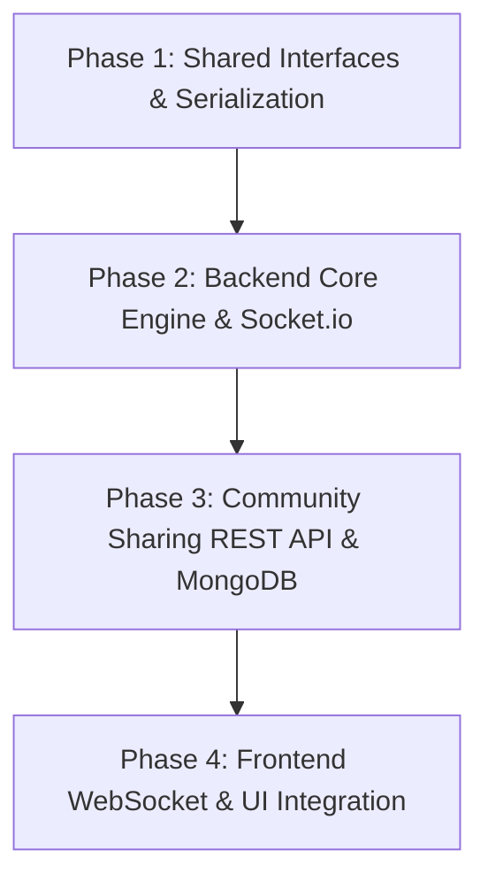

# Implementation Plan: Simplified Dynamic Status Node Calculator (No Buffs/Timeline)

This updated implementation plan aligns with the simplified requirements: **removing all Buff nodes, Timeline features, and time-based calculations**. The focus is strictly on a visual, DAG-based calculator that computes RPG-style status additions with multiplier zones.

---

## User Review Required

We have identified several design items that require user review or feedback:

> [!IMPORTANT]
> **1. Output and Operator Nodes Value Constraint**
> In the current UI, clicking an Output or Operator Node still allows users to manually type in a "Value" in the Inspector Panel. In a DAG graph, Output/Operator node values should be strictly calculated from their parents.
> _Proposal_: We will disable manual value input for `output` and `operator` nodes in the Inspector Panel, displaying a read-only field with the calculated result.
>
> **2. Zero Rule Enforcement**
> "The Zero Rule" states that missing or invalid values = 0.
> We need to ensure that the calculation engine treats any disconnected target handles on Operator Nodes as `0` instead of breaking. For example, if Handle A is connected but Handle B is not, the operation `A - B` will evaluate to `A - 0 = A`.

---

## Open Questions

> [!WARNING]
> **Share Short URL Subdomain / Domain**
> The SRS specifies that sharing generates a URL like `https://domain.com/s/uuid`.
> Since we are running the frontend on `localhost:5173` and the backend on `localhost:5000` during local dev, should we generate `http://localhost:5173/s/{uuid}` for the local development environment?

---

## Proposed Changes

We divide the simplified implementation into 4 logical phases, proceeding from core data structure adjustments to full backend execution and frontend integration.



---

### Component 1: Shared Types & Core Definitions

#### [MODIFY] [types.ts](file:///d:/GitHub/114-2_WebAPP_Team10/shared/types.ts)

- Simplify `NodeData` interface by removing `startTime`, `endTime`, and removing `buff` from `type`.
- Extend `EdgeData` interface to fully support Operator Node connections by including React Flow's `sourceHandle` and `targetHandle`.

```typescript
export interface NodeData {
  id: string;
  type: 'input' | 'output' | 'operator'; // Removed 'buff'
  label?: string;
  multiplierZone: string;
  value: number;
  isPercentage: boolean;
  operator?: '+' | '-' | '*' | '/';
}

export interface EdgeData {
  source: string; // Source Node ID
  target: string; // Target Node ID
  sourceHandle?: string; // e.g. 'a', 'b' for Operator Node A/B inputs
  targetHandle?: string;
}
```

---

### Component 2: Frontend State Serialization & Circular Detection

#### [MODIFY] [useStore.ts](file:///d:/GitHub/114-2_WebAPP_Team10/frontend/src/store/useStore.ts)

- **Simplify State**: Remove `currentTime` and `setCurrentTime` from the Zustand store.
- **Edge Handle Serialization**: Update `getGraphState()` to retrieve and map `sourceHandle` and `targetHandle` from React Flow edges so they are not lost during save operations.
- **Circular Dependency Prevention**: Update `onConnect` to run a depth-first search (DFS) cycle-detection utility before adding an edge. If a cycle is detected, block the connection.
- **Add Calculation Result State**: Add a `results: Record<string, number>` state in Zustand store to store the dynamic results returned by the backend.

---

### Component 3: Backend Database & REST API

#### [NEW] [graph.ts](file:///d:/GitHub/114-2_WebAPP_Team10/backend/src/models/graph.ts)

- Define Mongoose schema matching the simplified `GraphState` interface.
- Store a unique, automatically generated UUID and the serialized nodes & edges.

#### [NEW] [shareController.ts](file:///d:/GitHub/114-2_WebAPP_Team10/backend/src/controllers/shareController.ts)

- Implement `shareGraph`: Receives `GraphState`, validates JSON, stores in MongoDB, and returns a share ID (UUID).
- Implement `loadGraph`: Receives share ID, fetches from MongoDB, and returns the graph data.

#### [NEW] [shareRoutes.ts](file:///d:/GitHub/114-2_WebAPP_Team10/backend/src/routes/shareRoutes.ts)

- Define `POST /api/share` and `GET /api/share/:id` Express endpoints.

---

### Component 4: Backend Calculation & DAG Engine

#### [NEW] [calcEngine.ts](file:///d:/GitHub/114-2_WebAPP_Team10/backend/src/utils/calcEngine.ts)

- **Topological Sorting**: Enforce Kahn's Algorithm or DFS sorting on incoming graphs to ensure upstream calculations happen before downstream evaluation.
- **Strict Evaluator (The Zero Rule)**:
  - Treat absent inputs or missing connections as `0`.
  - Do not apply implicit hidden base values.
- **Multiplier Zone Convergence Logic**:
  - For a node, group all incoming inputs by their `multiplierZone` attribute.
  - Inside each zone, sum the values: $ZoneValue = \sum Value$.
  - Across different zones, multiply the zone results together: $TotalInput = \prod ZoneValue$.
- **Operator Node Computing**:
  - Resolve operands ordered by handles: operand A (`a` handle) and operand B (`b` handle).
  - Compute $A \ [op] \ B$ for $+$, $-$, $*$, $/$. If $B = 0$ during division, output $0$ and log a safe division-by-zero warning.

#### [MODIFY] [index.ts](file:///d:/GitHub/114-2_WebAPP_Team10/backend/src/index.ts)

- Hook up Socket.io server.
- Bind `update_graph` listener:
  1. Receive `{ graph: GraphState }` (no currentTime).
  2. Execute `calcEngine.calculate(graph)`.
  3. Emit `calc_result` back to client containing a map of `{ [nodeId]: calculatedValue }`.
- Mount `/api/share` routes onto the Express app.

---

### Component 5: Frontend WebSocket & UI Integration

#### [NEW] [websocket.ts](file:///d:/GitHub/114-2_WebAPP_Team10/frontend/src/services/websocket.ts)

- Establish real-time connection to backend WebSocket server.
- Synchronize graphs: Hook into Zustand store subscriptions. Whenever `nodes` or `edges` change, debounced-emit `update_graph`.
- Handle calculation responses: Listen to `calc_result` and dispatch updates to store `results`.

#### [DELETE] [Timeline.tsx](file:///d:/GitHub/114-2_WebAPP_Team10/frontend/src/components/Timeline.tsx)

- Delete the timeline slider component as it is no longer required.

#### [MODIFY] [Canvas.tsx](file:///d:/GitHub/114-2_WebAPP_Team10/frontend/src/components/Canvas.tsx)

- Remove `Timeline` from layout imports and rendering.
- Clean up `buff` styling in the MiniMap color maps.

#### [MODIFY] [CalcNode.tsx](file:///d:/GitHub/114-2_WebAPP_Team10/frontend/src/components/nodes/CalcNode.tsx) and [OperatorNode.tsx](file:///d:/GitHub/114-2_WebAPP_Team10/frontend/src/components/nodes/OperatorNode.tsx)

- Pull calculated results from `results` state in Zustand.
- If it is an Output or Operator node, render the _calculated result_ prominently instead of static/editable input properties.
- Remove `buff` node registration and style maps from the frontend.

#### [MODIFY] [InspectorPanel.tsx](file:///d:/GitHub/114-2_WebAPP_Team10/frontend/src/components/InspectorPanel.tsx)

- Remove the "Timeline" section (Start/End times) and references to `isBuff`.
- Set output/operator node value inputs to read-only.

---

## Verification Plan

### Automated Tests

- Write Jest/Vitest unit tests for the `calcEngine` covering:
  - Directed Acyclic Graphs (normal flow).
  - Multiplier Zone additions and cross-zone multiplications.
  - Non-commutative operations (A - B vs B - A).
  - Zero Rule edge cases (disconnected handles, division by zero).

### Manual Verification

1. **Interactive Demo**: Connect multiple zones, enter values, and observe output values updating instantly via WebSockets.
2. **UGC Sharing Flow**: Click the "Share" button, verify the clipboard copy of `http://localhost:5173/s/{uuid}`, open the link in an incognito window, and verify the graph renders identically.

---

## Expert Suggestions

> [!TIP]
> **1. Cycle Prevention UX**
> Rather than letting the user draw a cycle and then alerting them with an ugly error dialog, we should use React Flow's `isValidConnection` prop. Inside `isValidConnection`, we check if the potential edge creates a cycle using our DFS check, and if so, return `false`. This prevents the connection visually in real-time, giving the user a premium, polished experience.
>
> **2. Auto-Wipe Legacy Files**
> Since we are removing the `buff` type and the timeline fields, there might be legacy `.calc` files on Google Drive containing `type: 'buff'`. We should write a defensive parser on the frontend that gracefully converts or drops legacy `buff` nodes to `input` nodes to prevent frontend parsing crashes.
