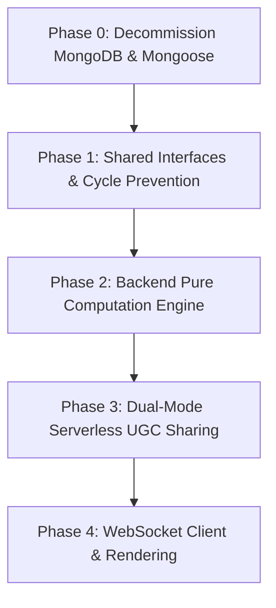

# Implementation Plan: Stateless & Decentralized Status Node Calculator (Simplified Aggregation)

This updated implementation plan aligns with the simplified requirements: **removing all Multiplier Zones** from the system specifications.

The shared interfaces, frontend components, and backend calculation engine will be completely streamlined. Multiple inputs to a single node will now be processed as a **Simple Sum Aggregation** ($Input = \sum Upstream$), keeping the calculator extremely clean, performant, and database-less.

---

## User Review Required

We have identified several design items that require user review or feedback:

> [!IMPORTANT]
> **1. Output and Operator Nodes Value Constraint**
> In the current UI, clicking an Output or Operator Node still allows users to manually type in a "Value" in the Inspector Panel. In a DAG graph, Output/Operator node values should be strictly calculated from their parents.
> _Proposal_: We will disable manual value input for `output` and `operator` nodes in the Inspector Panel, displaying a read-only field with the calculated result.
>
> **2. Zero Rule Enforcement**
> "The Zero Rule" states that missing or invalid values = 0.
> We need to ensure that the calculation engine treats any disconnected target handles on Operator Nodes as `0` instead of breaking. For example, if Handle A is connected but Handle B is not, the operation `A - B` will evaluate to `A - 0 = A`.

---

## Technical Architecture (Database-less & Serverless)

By removing MongoDB, the tech stack becomes incredibly clean:

- **Backend (Node.js + Socket.io)**: A stateless microservice dedicated purely to real-time high-speed graph computation.
- **Frontend (React + Zustand + React Flow)**: Manages UI rendering, DFS cycle-prevention, Google Drive OAuth operations, and URL serialization.

---

## Proposed Changes

We divide this decentralized implementation into 5 sequential phases:



---

### Phase 0: Decommission MongoDB & Mongoose

We will purge all database connections, services, and libraries from both the local repository configuration and docker infrastructure.

#### [MODIFY] [docker-compose.yml](file:///d:/GitHub/114-2_WebAPP_Team10/docker-compose.yml)

- Delete the entire `mongodb` service container block.
- Delete the `mongodb_data` volume block at the bottom of the file.
- Modify the `backend` service block to remove `depends_on` and `MONGODB_URI`.

#### [MODIFY] [package.json (backend)](file:///d:/GitHub/114-2_WebAPP_Team10/backend/package.json)

- Remove `"mongoose"` from dependencies.

#### [MODIFY] [index.ts (backend)](file:///d:/GitHub/114-2_WebAPP_Team10/backend/src/index.ts)

- Remove mongoose imports and database connection logic, leaving a pure Express and Socket.io microservice.

---

### Component 1: Shared Types & Core Definitions

#### [MODIFY] [types.ts](file:///d:/GitHub/114-2_WebAPP_Team10/shared/types.ts)

- Simplify the `NodeData` interface: **remove `multiplierZone`**.
- Extend `EdgeData` interface to fully support Operator Node connections by including React Flow's `sourceHandle` and `targetHandle`.
- **Reference Code Blocks**:

```typescript
export interface NodeData {
  id: string;
  type: 'input' | 'output' | 'operator';
  label?: string; // Optional display name
  value: number; // Numeric stat value
  isPercentage: boolean; // True if value is a percentage
  operator?: '+' | '-' | '*' | '/'; // Only for operator nodes
}

export interface EdgeData {
  source: string; // Source Node ID
  target: string; // Target Node ID
  sourceHandle?: string; // e.g. 'a', 'b' for Operator Node A/B inputs
  targetHandle?: string;
}
```

---

### Component 2: Frontend State Serialization & Circular Detection

#### [MODIFY] [useStore.ts](file:///d:/GitHub/114-2_WebAPP_Team10/frontend/src/store/useStore.ts)

- **State Simplification**: Remove `multiplierZone` defaults from the `addNode()` initializer.
- **Edge Handle Serialization**: Update `getGraphState()` to retrieve and map `sourceHandle` and `targetHandle` from React Flow edges so they are not lost during save/share operations.
- **Circular Dependency Prevention**: Update `onConnect` to run a depth-first search (DFS) cycle-detection utility before adding an edge. If a cycle is detected, block the connection.
- **Add Calculation Result State**: Add a `results: Record<string, number>` state in Zustand store to store the dynamic results returned by the backend.

---

### Component 3: Dual-Mode Serverless UGC Sharing (Database-less)

Instead of a REST API and MongoDB, all sharing happens through the frontend:

#### [NEW] [lz-string.ts] or install via npm

- **Option 1: LZ URL Compression (Anonymous Sharing)**:
  - When the user clicks "Share" (and is not logged in), serialize `GraphState` to JSON, compress it with LZ-string, and output a URL-safe Base64 hash:
    `https://domain.com/#/s/{compressed_base64}`
  - When loading the site, decompress the Base64 hash back to JSON, and inject it into the Zustand store.
- **Option 3: Google Drive Permissions Sharing (Authenticated Sharing)**:
  - Call the Google Drive Permissions API to insert a permission of `{ role: 'reader', type: 'anyone' }` for the `.calc` file.
  - Return a URL-safe sharing link containing the file ID:
    `https://domain.com/#/drive/{google_drive_file_id}`
  - When loading the site, download the public `.calc` file directly from Google Drive public files endpoint and render the canvas.

---

### Component 4: Backend Calculation & DAG Engine (Stateless)

#### [NEW] [calcEngine.ts](file:///d:/GitHub/114-2_WebAPP_Team10/backend/src/utils/calcEngine.ts)

- **Topological Sorting**: Enforce Kahn's Algorithm or DFS sorting on incoming graphs to ensure upstream calculations happen before downstream evaluation.
- **Strict Evaluator (The Zero Rule)**:
  - Treat absent inputs or missing connections as `0`.
  - Do not apply implicit hidden base values.
- **Simple Sum Aggregation**:
  - **No Multiplier Zones**. If multiple upstream nodes connect to a single node, their inputs are aggregated purely using **addition**:
    $$Input = \sum Value_{upstream}$$
- **Operator Node Computing**:
  - Resolve operands ordered by handles: operand A (`a` handle) and operand B (`b` handle).
  - Compute $A \ [op] \ B$ for $+$, $-$, $*$, $/$. If $B = 0$ during division, output $0$ and log a safe division-by-zero warning.

#### [MODIFY] [index.ts](file:///d:/GitHub/114-2_WebAPP_Team10/backend/src/index.ts)

- Bind `update_graph` listener:
  1. Receive `{ graph: GraphState }`.
  2. Execute `calcEngine.calculate(graph)`.
  3. Emit `calc_result` back to client containing a map of `{ [nodeId]: calculatedValue }`.

---

### Component 5: Frontend WebSocket & UI Integration

#### [NEW] [websocket.ts](file:///d:/GitHub/114-2_WebAPP_Team10/frontend/src/services/websocket.ts)

- Establish real-time connection to backend WebSocket server.
- Synchronize graphs: Hook into Zustand store subscriptions. Whenever `nodes` or `edges` change, debounced-emit `update_graph`.
- Handle calculation responses: Listen to `calc_result` and dispatch updates to store `results`.

#### [MODIFY] [Canvas.tsx](file:///d:/GitHub/114-2_WebAPP_Team10/frontend/src/components/Canvas.tsx)

- Integrate URL routing checks on mount to parse both `#/s/{compressed_base64}` and `#/drive/{fileId}` to load community-shared models.
- **Delete Key Shortcut**: Configure React Flow's `deleteKeyCode` property to `'Delete'` to change the deletion keyboard shortcut from Backspace to the Delete key, aligning with standard OS deletion layouts.

#### [MODIFY] [CalcNode.tsx](file:///d:/GitHub/114-2_WebAPP_Team10/frontend/src/components/nodes/CalcNode.tsx)

- Pull calculated results from `results` state in Zustand.
- If it is an Output node, render the _calculated result_ prominently instead of static/editable input properties.
- **Visual Cleanup**: Remove the rendering of `multiplierZone` label from the bottom of the node body.

#### [MODIFY] [InspectorPanel.tsx](file:///d:/GitHub/114-2_WebAPP_Team10/frontend/src/components/InspectorPanel.tsx)

- Set output/operator node value inputs to read-only.
- **Visual Cleanup**: Completely remove the "Zone" text field input from the Value properties section.

---

## Verification & Automated Test Plan

### 1. Backend Core Calculation Engine (Backend Unit Tests)

- **Test Suite 1: DAG Topological Sorting (REQ-4.1.1 / UC1)**
  - `Sort Normal DAG`: Verify the topological ordering is calculated correctly (e.g., Input -> Operator -> Output).
  - `Detect Cycle`: Verify that if a cyclic dependency slips past the frontend, the backend engine detects it and safely throws a `CircularDependencyError`.
- **Test Suite 2: Simple Sum Aggregation (REQ-4.1.2 / UC2)**
  - `Aggregate with Addition`: Verify that multiple upstream inputs to a single node are accumulated purely using **addition** (Sum Aggregation).
  - `The Zero Rule`: Verify that any absent, unconfigured, or undefined values default to `0` with no hidden implicit base variables.
- **Test Suite 3: Operator Node Computations (UC10)**
  - `Commutative Operations`: Verify correct calculations for addition (`+`) and multiplication (`*`).
  - `Non-commutative & Ordering`: Verify subtraction (`-`) and division (`/`) strictly calculate `Handle A [op] Handle B`.
  - `Safe Division-by-Zero`: Verify that if the divisor is `0` or disconnected, it outputs `0` with a warning log.

### 2. Frontend State & Decentralized Sharing (Frontend Unit & Integration Tests)

- **Test Suite 4: Circular Prevention UX (UC1)**
  - `Block Cyclical Edges in store`: Test that the Zustand `onConnect` DFS checker halts circular connections.
  - `isValidConnection Callback`: Test that React Flow's `isValidConnection` returns `false` when drawing a cyclic line.
- **Test Suite 5: LZ-String Anonymous Sharing (UC5 / UC6)**
  - `Compress State to URL Hash`: Test that `getGraphState()` outputs are successfully compressed by `lz-string` and set onto the browser hash (`#/s/...`).
  - `Decompress Hash to Canvas`: Test that booting the web app with a valid `#/s/{compressed}` URL correctly hydrates the Zustand store.
- **Test Suite 6: Google Drive Permissions Sharing (UC8 / UC9)**
  - `Create Public Reader Permission`: Verify the Google Drive permission request posts `{ role: 'reader', type: 'anyone' }`.
  - `Anonymous Fetch from Public Drive`: Verify that accessing `#/drive/{fileId}` downloads and renders the model without requiring OAuth.

### Manual Verification

1. **Scrubbing Interactive Demo**: Connect active inputs, type in values, and observe instant simple sum aggregation results via WebSockets.
2. **Anonymous URL Sharing Loop**: Click "Share" (not logged in), verify `http://localhost:5173/#/s/{compressed}` is in clipboard. Open in incognito, verify nodes render.
3. **Google Drive Permission Sharing Loop**: Log in to Google, click "Publish & Share", copy `http://localhost:5173/#/drive/{fileId}`. Open in incognito, verify model loads.
