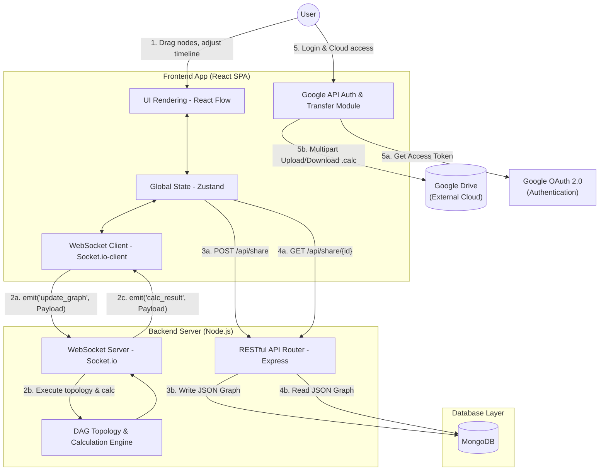
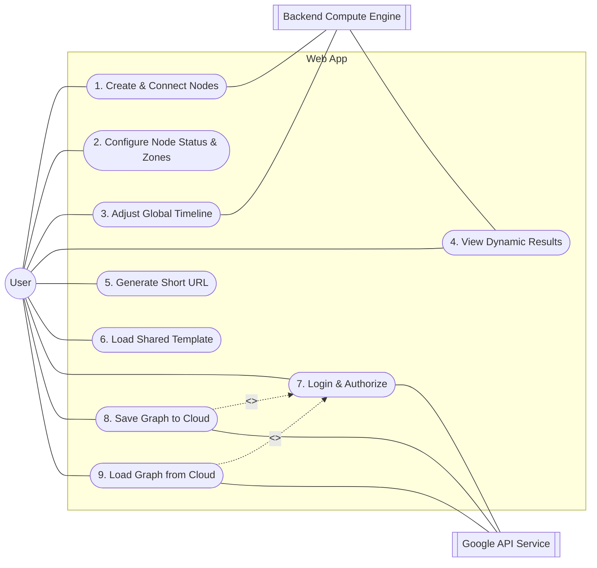

# Software Requirement Specification (SRS)

## 1. Introduction

### 1.1 Purpose

<<<<<<< HEAD

This document defines the architecture, functional/non-functional requirements, and system interfaces for the "Dynamic Status Node Calculator". It serves as the core instruction manual for the development team and acts as the primary system context for AI agents (e.g., Claude, Antigravity) during full-stack code generation.

### 1.2 System Scope

The system is a Web-based thin-client application providing gamers and theorycrafters with a visual, drag-and-drop node interface. It is used to construct complex numerical formulas (e.g., damage/stat calculation) and simulate dynamic state changes (Buffs/Debuffs) over a timeline. The system supports account-less UGC sharing via short URLs and deep integration with Google Drive for persistent personal storage.

### 1.3 Glossary

=======
This document defines the architecture, functional/non-functional requirements, and system interfaces for the "Dynamic Status Node Calculator". It serves as the core instruction manual for the development team and acts as the primary system context for AI agents (e.g., Claude, Antigravity) during full-stack code generation.

### 1.2 System Scope

The system is a Web-based thin-client application providing gamers and theorycrafters with a visual, drag-and-drop node interface. It is used to construct complex numerical formulas (e.g., damage/stat calculation) and simulate dynamic state changes (Buffs/Debuffs) over a timeline. The system supports account-less UGC sharing via short URLs and deep integration with Google Drive for persistent personal storage.

### 1.3 Glossary

> > > > > > > 3432432fd0438e3253e1ae69fe174814624ec606

- **DAG (Directed Acyclic Graph):** The core data structure for all numerical nodes and edges. Circular dependencies are strictly prohibited.
- **Multiplier Zone:** Independent blocks of calculation. Values within the same zone are combined using addition; values across different zones are combined using multiplication.
- **Debouncing:** A performance optimization technique ensuring high-frequency events (e.g., dragging the timeline slider) trigger server requests only after the user pauses, preventing server overload.

## 2. System Architecture

### 2.1 System Architecture Diagram

<<<<<<< HEAD

=======

> > > > > > > 3432432fd0438e3253e1ae69fe174814624ec606
> > > > > > > This diagram illustrates the data flow and protocols between the frontend, backend compute server, database, and external cloud services.



### 2.2 Tech Stack Constraints

<<<<<<< HEAD

=======

> > > > > > > 3432432fd0438e3253e1ae69fe174814624ec606

- **Frontend Framework:** React, TypeScript.
- **Backend Framework:** Node.js, Express, Socket.io.
- **Database:** MongoDB (NoSQL).

### 2.3 Local & Collaborative Development Environment Specifications

<<<<<<< HEAD

The project utilizes Docker and Docker Compose as the standard for local backend and database development.

#### 2.3.1 Multi-Architecture Support Requirements

=======
The project utilizes Docker and Docker Compose as the standard for local backend and database development.

#### 2.3.1 Multi-Architecture Support Requirements

> > > > > > > 3432432fd0438e3253e1ae69fe174814624ec606

- **Native Execution Principle:** Running x86 database images via the Rosetta 2 translation layer on Apple M-series chips (e.g., M4) is strictly prohibited.
- **Dependency Constraints:** Developers must select Docker images from Docker Hub that explicitly support both `linux/arm64` and `windows` architectures. The system must rely on the Docker Engine's auto-detection to pull the native version for the host machine.

#### 2.3.2 Containerization Configuration (Docker Compose)

<<<<<<< HEAD

A shared `docker-compose.yml` must be maintained at the project root following Infrastructure as Code (IaC) principles.

=======
A shared `docker-compose.yml` must be maintained at the project root following Infrastructure as Code (IaC) principles.

> > > > > > > 3432432fd0438e3253e1ae69fe174814624ec606

1. **Database Layer (MongoDB):**
   - **Image:** Use a stable dual-arch version (e.g., `mongo:7.0`). The `latest` tag is prohibited to prevent unexpected version behaviors.
   - **Data Persistence:** Must configure Docker Volumes (e.g., `/data/db`) to ensure test graphs and mock data are not lost upon container restart/destruction.
   - **Port Mapping:** Map host port `27017` to container port `27017`.
2. **Backend Layer (Node.js API & WebSocket):**
   - **Hot-Reloading:** The backend container must map the local source code directory via Volumes and launch via `nodemon` or `tsx watch`. This ensures instant server reloads on file save without rebuilding the container.
   - **Environment Variable Injection:** MongoDB Connection Strings and JWT Secrets must be injected via a `.env` file. The `.env` file must be gitignored and never committed.

#### 2.3.3 Frontend Development Strategy

<<<<<<< HEAD

=======

> > > > > > > 3432432fd0438e3253e1ae69fe174814624ec606

- To maximize React/Vite Hot Module Replacement (HMR) performance and browser debugging capabilities, the frontend application is **not** strictly required to be containerized locally.
- Developers run the frontend natively via `npm run dev` (Node v20.x LTS recommended via NVM) and proxy API requests to the Dockerized backend (`localhost:3000`).

#### 2.3.4 Standard Operating Procedure (SOP)

<<<<<<< HEAD

Standard daily workflow after cloning the repository:

=======
Standard daily workflow after cloning the repository:

> > > > > > > 3432432fd0438e3253e1ae69fe174814624ec606

1. **Start Backend & DB:** Run `docker-compose up -d` at the project root.
2. **Start Frontend:** In a separate terminal, navigate to the `frontend` directory and run `npm run dev`.
3. **Shutdown & Cleanup:** Run `docker-compose down` to stop services (data retained). Run `docker-compose down -v` to completely wipe test data.

## 3. Use Case Analysis

<<<<<<< HEAD

=======

> > > > > > > 3432432fd0438e3253e1ae69fe174814624ec606
> > > > > > > The Primary Actor for this system is the **User** (Gamer / Theorycrafter).

### 3.1 Use Case Diagram



### 3.2 Use Case Specifications

#### UC0: Initialization of the Dashboard and Canvas Framework

The goal of this UC is to establish a "What You See Is What You Get" (WYSIWYG) base UI, giving your team a solid foundation where nodes and logic can be added later.

<<<<<<< HEAD

- **Main Flow:**
  1.  Upon entering the web app, the system loads a full-screen React Flow canvas.
  2.  The left side displays a **Toolbox**: Lists available node templates (e.g., Input Node, Buff Node, Output Node).
  3.  The center area is the **Canvas**: Supports zooming, panning, and grid-snapping.
  4.  The right side displays the **Inspector (Property Panel)**: Initially empty, but will expand/populate when a node is clicked.
  5.  The bottom area displays a **Timeline**: A slider initially set to 0 seconds.
- **Acceptance Criteria (AC):**
  - **AC1 - Canvas Completeness:** The user must see a functional canvas with a visible background grid.
  - **AC2 - Layout Consistency:** The Toolbox and Inspector must be fixed sidebars that do not move when the canvas is zoomed or panned.
  - **AC3 - Responsive Design:** The canvas must automatically fill the remaining screen space across different monitor sizes.

#### UC1: Create & Connect Numerical Nodes

=======

- **Main Flow:**
  1.  Upon entering the web app, the system loads a full-screen React Flow canvas.
  2.  The left side displays a **Toolbox**: Lists available node templates (e.g., Input Node, Buff Node, Output Node).
  3.  The center area is the **Canvas**: Supports zooming, panning, and grid-snapping.
  4.  The right side displays the **Inspector (Property Panel)**: Initially empty, but will expand/populate when a node is clicked.
  5.  The bottom area displays a **Timeline**: A slider initially set to 0 seconds.
- **Acceptance Criteria (AC):**
  - **AC1 - Canvas Completeness:** The user must see a functional canvas with a visible background grid.
  - **AC2 - Layout Consistency:** The Toolbox and Inspector must be fixed sidebars that do not move when the canvas is zoomed or panned.
  - **AC3 - Responsive Design:** The canvas must automatically fill the remaining screen space across different monitor sizes.

#### UC1: Create & Connect Numerical Nodes

> > > > > > > 3432432fd0438e3253e1ae69fe174814624ec606

- **Precondition:** Canvas is initialized.
- **Trigger:** User drags a node from the toolbox to the canvas.
- **Main Flow:**
  1. System renders an input or output node on the canvas.
  2. User drags from Node A's output handle to Node B's input handle.
  3. Frontend immediately blocks any connection that would create a Circular Dependency.
  4. System syncs the topology changes to the backend via WebSocket.
- **Postcondition:** DAG structure is successfully updated.

#### UC2: Configure Node Status & Multiplier Zones

<<<<<<< HEAD

=======

> > > > > > > 3432432fd0438e3253e1ae69fe174814624ec606

- **Precondition:** Nodes exist on the canvas.
- **Trigger:** User clicks a node to open the Property Inspector.
- **Main Flow:**
  1. User inputs a numeric value and defines the node's attributes.
  2. **Domain Constraint:** Zones with different names are treated as strictly independent (no automatic merging). E.g., "Crit Rate" (15%) and "Final Crit Rate" (20%) are calculated as separate multiplied zones.
  3. **Strict Evaluation:** The system MUST NOT implicitly assume hidden base values. If no base probability is declared on the canvas, the system must not assume a default 50%. Calculations must strictly reflect the user's explicit node connections.
- **Postcondition:** Node properties updated, triggering calculation.

#### UC3: Adjust Global Timeline

<<<<<<< HEAD

=======

> > > > > > > 3432432fd0438e3253e1ae69fe174814624ec606

- **Precondition:** At least one "Status/Buff Node" with time parameters exists.
- **Trigger:** User drags the global timeline slider at the bottom.
- **Main Flow:**
  1. Frontend triggers `onChange` event, applying Debounce logic.
  2. Once dragging stops, frontend emits the `currentTime` to the backend.
  3. Backend filters nodes, activating only Status nodes where `startTime <= currentTime <= endTime`.
- **Postcondition:** Timeline state updated, triggering backend compute engine.

#### UC4: View Dynamic Calculation Results

<<<<<<< HEAD

=======

> > > > > > > 3432432fd0438e3253e1ae69fe174814624ec606

- **Precondition:** Backend compute engine finishes topological sorting and calculation.
- **Main Flow:**
  1. Backend emits `calc_result` event via WebSocket to the frontend.
  2. Frontend parses the payload and updates the numeric displays on "Output Nodes".
  3. Frontend applies CSS highlighting to Buff nodes that are currently active at the selected timeline second.

#### UC5: Generate Shareable Short URL

<<<<<<< HEAD

=======

> > > > > > > 3432432fd0438e3253e1ae69fe174814624ec606

- **Precondition:** User finished configuring the graph.
- **Main Flow:**
  1. User clicks "Share".
  2. Frontend serializes `GraphState` to JSON and sends a POST request to the REST API.
  3. Backend generates a unique UUID, storing the UUID and JSON in MongoDB.
  4. System returns a short URL (e.g., `https://domain.com/s/uuid`) and copies it to the clipboard.
- **Postcondition:** The current graph state is permanently saved as Immutable Data.

#### UC6: Load Community Shared Template (Fork Mechanism)

<<<<<<< HEAD

=======

> > > > > > > 3432432fd0438e3253e1ae69fe174814624ec606

- **Precondition:** User opens a short URL containing a UUID.
- **Main Flow:**
  1. Frontend extracts the UUID parameter and sends a GET request to the REST API.
  2. Backend fetches the corresponding JSON graph from MongoDB.
  3. Zustand state manager injects the data, instantly rendering the React Flow canvas.
  4. If the user edits the canvas and shares again, UC5 repeats, generating a new UUID without modifying the original data.

#### UC7: Login & Authorization

<<<<<<< HEAD

=======

> > > > > > > 3432432fd0438e3253e1ae69fe174814624ec606

- **Precondition:** User clicks any Google Drive integration button.
- **Main Flow:**
  1. System triggers Google Identity Services OAuth 2.0 popup.
  2. User logs in and grants scope: `https://www.googleapis.com/auth/drive.file`.
  3. System caches the Access Token in frontend memory.

#### UC8: Save Graph to Google Drive

<<<<<<< HEAD

=======

> > > > > > > 3432432fd0438e3253e1ae69fe174814624ec606

- **Precondition:** Includes UC7 (Authorized).
- **Main Flow:**
  1. Frontend converts `GraphState` to a JSON file named `{filename}.calc`.
  2. Frontend issues a `multipart/form-data` POST request directly to the Google Drive REST API.
  3. File is saved inside the user's `appDataFolder` to avoid cluttering their visible Drive files.
  4. UI displays success toast.

#### UC9: Load Graph from Google Drive

<<<<<<< HEAD

=======

> > > > > > > 3432432fd0438e3253e1ae69fe174814624ec606

- **Precondition:** Includes UC7 (Authorized).
- **Main Flow:**
  1. System calls Drive API to list all `.calc` files inside `appDataFolder`.
  2. UI renders a file picker list.
  3. Upon selection, system downloads the file, deserializes the JSON, and overwrites the canvas state.

## 4. Detailed Functional Requirements

### 4.1 Algorithm & Topological Sorting

<<<<<<< HEAD

=======

> > > > > > > 3432432fd0438e3253e1ae69fe174814624ec606

- **REQ-4.1.1 Topology Engine:** Upon receiving the DAG structure, the backend MUST execute Kahn's Algorithm or DFS topological sorting. Nodes with an in-degree of 0 must be calculated first. Downstream nodes are only evaluated after all dependencies provide their values.
- **REQ-4.1.2 Multiplier Zone Convergence Logic:**
  - If Node A and Node B connect to Node C, and A & B share the **same** multiplier zone: `C_input = Value_A + Value_B`.
  - If A & B have **different** multiplier zones: `C_input = Value_A * Value_B`.

### 4.2 Payload Specifications

<<<<<<< HEAD

=======

> > > > > > > 3432432fd0438e3253e1ae69fe174814624ec606
> > > > > > > Frontend and backend MUST share exact TypeScript Interfaces. AI Agents must use the following core structures to generate strongly-typed code:

```typescript
// Shared Types Definition
export interface NodeData {
  id: string;
  type: 'input' | 'output' | 'buff';
  multiplierZone: string; // Identifier for the calculation zone
<<<<<<< HEAD
  value: number; // Numeric stat value
  isPercentage: boolean; // True if value is a percentage
  startTime?: number; // Active start time for buffs
  endTime?: number; // Active end time for buffs
=======
  value: number;          // Numeric stat value
  isPercentage: boolean;  // True if value is a percentage
  startTime?: number;     // Active start time for buffs
  endTime?: number;       // Active end time for buffs
>>>>>>> 3432432fd0438e3253e1ae69fe174814624ec606
}

export interface EdgeData {
  source: string; // Source Node ID
  target: string; // Target Node ID
}

export interface GraphState {
  nodes: NodeData[];
  edges: EdgeData[];
}
```

## 5. External Interface Requirements

### 5.1 User Interface (UI)

<<<<<<< HEAD

=======

> > > > > > > 3432432fd0438e3253e1ae69fe174814624ec606

- **Canvas:** Must support "Snap to grid", infinite zooming, and panning. Nodes must be draggable, connected via bezier curves.
- **Timeline:** Horizontal slider at the bottom of the screen. Dragging must visually display the currently selected second in real-time.
- **Inspector Panel:** Clicking a node opens a dynamic right sidebar containing a dropdown (Multiplier Zone), numeric input, and a slider (Time range).

### 5.2 System & Communication Interfaces

<<<<<<< HEAD

=======

> > > > > > > 3432432fd0438e3253e1ae69fe174814624ec606

- **WebSocket Channel:**
  - Client Emits: `socket.emit('update_graph', { graph: GraphState, currentTime: number })`
  - Server Emits: `socket.on('calc_result', (results: Record<string, number>) => void)`
- **REST API Channel:**
  - **Share (POST):** Endpoint `/api/share`. Body: `GraphState` JSON. Returns HTTP 201 with `{"id": "uuid-string"}`.
  - **Load (GET):** Endpoint `/api/share/:id`. Returns HTTP 200 with the full `GraphState` JSON.

## 6. Non-Functional Requirements

### 6.1 Performance Constraints

<<<<<<< HEAD

=======

> > > > > > > 3432432fd0438e3253e1ae69fe174814624ec606

- **Timeline Debouncing:** In React, the timeline `onChange` event MUST implement a `100ms` debouncing logic. Rapid dragging MUST NOT trigger WebSocket emissions. The payload is only sent when the slider stops, preventing Node.js Event Loop starvation.
- **Compute Latency:** Backend topological sorting and DAG calculation for a single cycle MUST complete in `< 50ms`.

### 6.2 Reliability & Scalability

<<<<<<< HEAD

- **Service Decoupling:** The system MUST decouple the WebSocket server (stateful real-time compute) from the REST API (stateless sharing/storage) to allow independent horizontal scaling in the future.
- # **AI Code Generation Adaptation:** Project structure must enforce strict directory separation: `/frontend`, `/backend`, and `/shared`. The `/shared` directory must contain all TypeScript interfaces, serving as the Single Source of Truth for AI assistants during cross-platform code generation.
- **Service Decoupling:** The system MUST decouple the WebSocket server (stateful real-time compute) from the REST API (stateless sharing/storage) to allow independent horizontal scaling in the future.
- **AI Code Generation Adaptation:** Project structure must enforce strict directory separation: `/frontend`, `/backend`, and `/shared`. The `/shared` directory must contain all TypeScript interfaces, serving as the Single Source of Truth for AI assistants during cross-platform code generation.
  > > > > > > > 3432432fd0438e3253e1ae69fe174814624ec606
